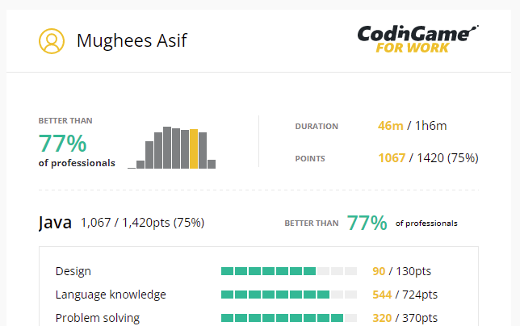

  

  

  

  

Languages
  

<code></code>
<code></code>
<code></code>
<code></code>
<code></code>

  

 

Technology
  

<code></code>
<code></code>
<code></code>
<code></code>
<code></code>
<code></code>
<code></code>
<code></code>
<code></code>
<code></code>
<code></code>
<code></code>
<code></code>

 

Biography
  

- 🌏 Lives in **London, UK** 
- 👨‍💻 Reading **MSc. Artificial Intelligence** @ _[School of Electronic Engineering and Computer Science](http://www.eecs.qmul.ac.uk/)_
- 🛠 Recently completed **BEng. Aerospace Engineering (Hons.)** from _[Queen Mary, University of London](https://www.qmul.ac.uk/undergraduate/coursefinder/courses/2020/aerospace-engineering/)_
- 🧠 Learning: **SQL** & **Decentralized Finance**
- 📖 Reading: **[The Innovators - Walter Isaacson](https://www.goodreads.com/book/show/21856367-the-innovators)**
- 🎧 Listening: **[The Godfather Waltz - Henry Mancini](https://youtu.be/7G9pTbBerB0)**
- 👓 Watching: **[Carlito's Way - Brian De Palma](https://en.wikipedia.org/wiki/Carlito%27s_Way)**
- ⚡ Fun fact: **Certified Personal Trainer** (Specialisation in Strength Training & HIIT)

> "If there’s anyone in this assembly, any dear friend of Caesar’s, I say to him that my love for Caesar was no less than his. If, then, that friend demands to know why I rose up against Caesar, this is my answer: **it’s not that I loved Caesar less, but that I loved Rome more**." ― Julius Caesar by Shakespeare (Act 3, Scene 2)

  
<!-- Activity graph -->

