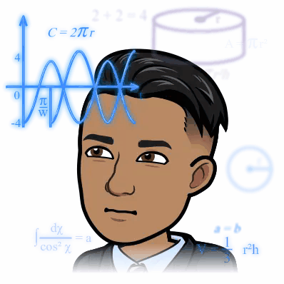
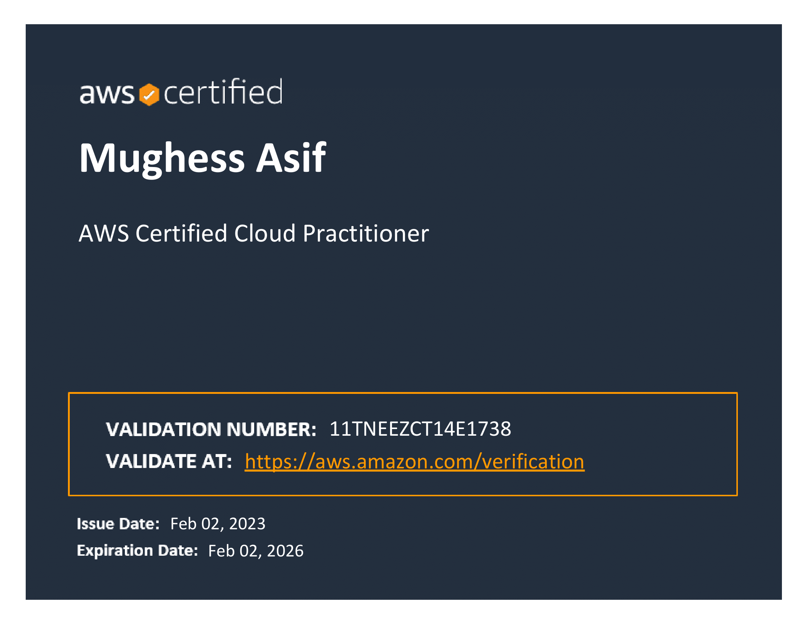

  

  

  

  <h1>
    
  </h1>

 

<h2  align="center">💡 VIEW IN LIGHT MODE 💡</h2>

Biography
  

  

- 🌏 Lives in **London, UK**
- 👨‍💻 Software Engineer II @ **[Amazon AI](https://www.amazon.jobs/en-gb/job_categories/software-development)**
- 🛠 Read **MSc. Artificial Intelligence** ('22) & **BEng. Aerospace Engineering (Hons.)** ('21) from **[Queen Mary, University of London](https://www.qmul.ac.uk/)**
- 🧠 Learning: **Distributed Streaming Technology**
- 📖
  Reading: **[Les Misérables - Victor Hugo](https://www.goodreads.com/user/show/138317498-mughees-asif)**
- 🎧
  Listening: **[So Many Tears - 2Pac](https://youtu.be/pFNDh4smb6k)**
- 👓
  Watching: **[I am the danger - Breaking Bad](https://youtu.be/31Voz1H40zI)**
- ♟ Plays: `e4`
- ⚡ Fun fact: **Certified Personal Trainer** (Specialisation in Strength Training, Kettlebell Training, and High-Intensity Interval Training (HIIT))
- 👴 Retirement plan: Study **Art History** in _Florence_, Italy.

> "If there’s anyone in this assembly, any dear friend of Caesar’s, I say to him that my love for Caesar was no less than his. If, then, that friend demands to know why I rose up against Caesar, this is my answer: **it’s not that I loved Caesar less, but that I loved Rome more**." ― Julius Caesar by Shakespeare (Act 3, Scene 2)

Languages
  

<code></code>
<code></code>
<code></code>
<code></code>
<code></code>

  

 

Technology
  

<code></code>
<code></code>
<code></code>
<code></code>
<code></code>
<code></code>
<code></code>
<code></code>
<code></code>
<code></code>
<code></code>
<code></code>
<code></code>

  

 

<!-- Activity graph -->

[comment]: <> (

)
